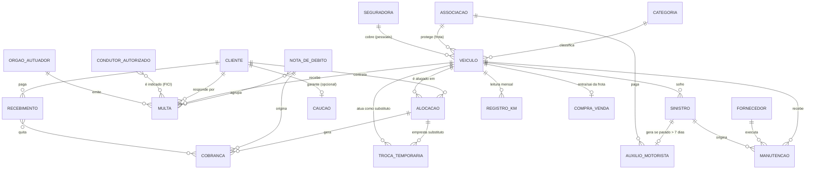

# Trade Rent a Car — Sistema de Gestão de Frota

**PRD + Especificação Funcional** · **Versão 1.1.1** · **17/07/2026** · Stack: a definir

> Substitui os controles feitos hoje em planilhas (`Frota.xlsx`, `multas e autuacoes.xlsx` e a planilha de conciliação bancária/financeira da Luciana). O [Anexo](#anexo--mapeamento-das-planilhas-atuais) mapeia as planilhas para as seções deste documento.

**Como ler este documento — origem do conteúdo:**
- 📄 **Planilhas** — campo/prática extraído das planilhas reais da operação.
- ✅ **Confirmado** — decisão ou explicação dada pelos donos (registradas na [Seção 8](#8-decisões-confirmadas-e-pontos-em-aberto)).
- 💡 **Proposta** — sugestão de funcionamento a validar; nada aqui é definitivo, especialmente mecânicas de sistema que não existem nas planilhas.

O documento descreve **o quê** o sistema precisa fazer (domínio e regras). **Não** define telas/UI — isso será desenhado depois, junto com a escolha da stack.

---

## Sumário

1. [Contexto e objetivo](#1-contexto-e-objetivo)
2. [Atores e acesso](#2-atores-e-acesso)
3. [Modelo de domínio](#3-modelo-de-domínio)
4. [Regras de negócio por módulo](#4-regras-de-negócio-por-módulo)
5. [Visibilidade: painel, alertas e relatórios](#5-visibilidade-painel-alertas-e-relatórios)
6. [Fluxos principais](#6-fluxos-principais)
7. [Roadmap](#7-roadmap)
8. [Decisões confirmadas e pontos em aberto](#8-decisões-confirmadas-e-pontos-em-aberto)
9. [Glossário](#9-glossário)
- [Anexo — Mapeamento das planilhas atuais](#anexo--mapeamento-das-planilhas-atuais)

---

## 1. Contexto e objetivo

### 1.1 O negócio
Locadora de veículos com foco em **motoristas de aplicativo** (região de BH). Frota de ~20 carros de locação (Gol, Voyage, Fiorino, Virtus, Tracker) 📄, alugados por **valor semanal** pago via Pix ✅. A frota é protegida pela **associação Auto Truck**; os donos também têm carros pessoais (com seguradora) acompanhados nas mesmas planilhas ✅. Dois donos operam tudo, cada um em seu computador.

### 1.2 Problemas que o sistema resolve
Hoje o controle está espalhado em planilhas (uma aba por carro nas multas; abas de frota, sinistros e KM; planilha financeira separada), gerando risco de:
- Perder prazos de indicação de condutor (FICI) — o que gera **multa NIC** contra a empresa 📄.
- Não saber quem está com qual carro e desde quando: as **trocas temporárias durante consertos** são anotadas como texto livre ("Arlen pegou o RUJ 5/5 enquanto reparos no dele") 📄.
- Perder o controle de pagamentos semanais, **notas de débito (ND)** emitidas e caução.
- Não acompanhar **dias de carro parado** — e deixar de receber o **auxílio motorista profissional** da associação (pago quando o conserto de colisão passa de 7 dias) ✅.
- Misturar na apuração do **DAS** receitas de locação (tributáveis, com fatura) e repasses (não tributáveis, com ND) ✅.
- Não saber quanto cada veículo custa vs. quanto gera.
- Perder vencimentos de rastreador, bateria (garantia), licenciamento e CNH.
- **Perder o ponto das manutenções preventivas por km** (troca de óleo, correia dentada etc.) — apontado pelos donos como **a necessidade mais importante do sistema** ✅.

### 1.3 Princípios
- **Simples e direto:** registrar rápido, enxergar o status geral em segundos.
- **Base única compartilhada:** os dois donos veem os mesmos dados, sempre atualizados.
- **Rastreabilidade financeira:** todo valor é atribuído a um veículo e/ou cliente, com classificação fiscal correta.
- **Alertas proativos:** avisar antes de vencer (FICI, manutenção, atraso, carro parado).
- **Reconhecível:** os campos vêm das planilhas reais da operação.

### 1.4 Fora do escopo (v1)
- App/portal para o cliente locatário.
- Integração automática com órgãos de trânsito (portais continuam manuais — ver cadastro de Órgãos).
- Emissão fiscal integrada (NF-e/fatura continua no processo atual; o sistema só **classifica e totaliza** — ver 4.4).
- Rastreamento GPS/telemetria (apenas cadastro do contrato de rastreador).
- **Importação das planilhas antigas** — opcional e adiada; a carga inicial pode usar outros dados organizados ✅.

---

## 2. Atores e acesso

| Ator | Descrição |
|------|-----------|
| **Donos / Gestores (2)** | Operam tudo, mesmo nível de acesso, cada um com seu login. Todo lançamento guarda autor e data/hora. |
| **Cliente / Motorista** | Locatário do veículo. Não acessa o sistema. |
| **Condutor autorizado** | Pessoa não-cliente que dirigiu o carro (pode ser indicada no FICI) 📄. |
| **Fornecedor / Oficina** | Ex.: By Car, Pedrinho Baterias, Diniz Baterias, Corujão Baterias 📄. |
| **Associação Auto Truck** | Proteção da frota: mensalidade por veículo, eventos, auxílio motorista profissional ✅. |
| **Seguradora** | Cobre apenas os veículos fora de locação (pessoais) ✅. |
| **Órgão Autuador** | PBH, DNIT, PRF, DER, CET, TRANSCON, prefeituras 📄. Cadastro guarda portal, credenciais e procedimento. |

Uso simultâneo: os dois podem editar ao mesmo tempo; vale a última gravação, com aviso quando ambos mexem no mesmo registro 💡.

---

## 3. Modelo de domínio

### 3.1 Entidades
- **Veículo** — carro da frota, com **categoria** (define faixa de preço) e **uso**: `Locação` ou `Fora de locação` (pessoal) ✅.
- **Cliente / Motorista** — locatário; tem CNH com validade acompanhada 📄.
- **Condutor autorizado** — cadastro leve para indicação em multas 📄.
- **Alocação** — vínculo cliente↔veículo com valor semanal e dia de vencimento.
- **Troca temporária** — carro substituto emprestado durante conserto, sem encerrar a alocação ✅.
- **Cobrança / Recebimento** — o que o cliente deve e o que pagou, com **classificação fiscal** ✅.
- **Nota de Débito (ND)** — cobrança numerada que agrupa repasses (em geral multas) 📄✅.
- **Caução** — garantia opcional ✅, com extrato de movimentações.
- **Manutenção** — serviço/gasto no veículo, com dias parado.
- **Sinistro / Evento** — colisão, dano ou roubo; pode acionar evento na associação 📄.
- **Auxílio motorista profissional** — crédito da associação quando conserto de colisão passa de 7 dias ✅.
- **Multa / Autuação** — infração com FICI, trâmite e repasse 📄.
- **Registro de KM** — leitura mensal de odômetro por veículo ✅.
- **Compra / Venda** — entrada e saída de veículos da frota.
- **Órgão Autuador**, **Fornecedor**, **Plano de proteção/seguro** — cadastros de apoio.

### 3.2 Diagrama

---

## 4. Regras de negócio por módulo

### 4.1 Veículos e cadastros de apoio

**Veículo** 📄 — placa (única), renavam, chassi, marca/modelo/ano, data e valor de aquisição, KM atual, motorista atual, chave reserva (sim/não/dúvida), rastreador (fornecedor + vigência), bateria (troca, fornecedor, garantia), licenciamento, status (`Disponível`, `Alocado`, `Em manutenção`, `Inativo`, `Vendido`).
- **Categoria** ✅ — carros de categorias diferentes têm valores semanais diferentes (relevante nas trocas temporárias). Cadastro simples: nome + valor semanal de referência 💡. Referências atuais ✅: **Gol R$ 650/semana, Voyage R$ 750/semana**, podendo variar conforme o combinado com cada motorista.
- **Uso** ✅ — `Locação` (frota, protegida pela Auto Truck) ou `Fora de locação` (pessoais — HB20, Tracker, Onix — com seguradora; só acompanham multas, manutenção e documentos; sem alocação, cobrança ou indicadores de rentabilidade da frota).
- Status muda automaticamente ao alocar / abrir manutenção; ajustável manualmente 💡.

**Plano de proteção (frota — Auto Truck)** ✅ — mensalidade por veículo (coluna "$ AT 19" da planilha: R$ 274/304/366 📄; o "19" é o **número de veículos assegurados** na Auto Truck ✅), taxa adicional que dá direito a **duas franquias gratuitas a cada 12 meses** ✅, e **auxílio motorista profissional** (ver 4.6). **Seguro (pessoais)** — seguradora, apólice, franquia, vigência.

**Cliente / Motorista** — nome, CPF/CNPJ (único), telefone/WhatsApp, CNH (número, categoria, **validade** 📄), endereço, dia da semana de vencimento ✅, status (`Ativo`, `Inadimplente`, `Inativo`). Alerta de CNH vencida ao alocar.
**Condutor autorizado** 📄 — nome, CPF/CNH opcionais, contato, cliente relacionado. Usado no FICI.

**Fornecedor / Oficina** — nome, contato, tipo de serviço (mecânica, funilaria, bateria, rastreador...).

**Órgão Autuador** 📄 — nome, esfera, portal, **login/senha (mascarados na interface)**, e-mail/telefone, **procedimento e documentos exigidos** (ex.: TRANSCON: "solicitar FICI, depois consultar FICI"; docs: doc. do veículo, CI do sócio, contrato social/CNPJ, CNH do motorista, FICI, termo de entrega), endereço físico quando o protocolo é presencial/AR.

### 4.2 Alocação e trocas temporárias

**Alocação** — veículo `Disponível` + cliente `Ativo`, data de início/término, **valor semanal**, **dia de vencimento semanal** (padrão: dia da semana do início ✅), caução opcional ✅, KM na entrega, limite de km (`Ilimitado`/`Limitado` + franquia mensal + taxa por km excedido) 📄, status (`Ativa`, `Encerrada`).

Regras:
- Um veículo tem no máximo uma alocação ativa.
- Ao criar: veículo → `Alocado`; cliente vira motorista atual. Ao encerrar: registra KM de devolução, veículo → `Disponível`, dispara acerto de caução (se houver).
- Multas, sinistros e KM de cada data são atribuídos a quem estava com o carro — **considerando trocas temporárias**.

**Troca temporária** ✅ — prática frequente: o carro vai para conserto e o cliente pega outro emprestado, depois retoma o seu 📄. No sistema:
- A alocação principal **não é encerrada**; registra-se a troca vinculada: veículo substituto, retirada/devolução (data/hora), KM do substituto, motivo (vínculo com a manutenção).
- **O valor semanal pode mudar durante a troca**, principalmente se o substituto for de categoria diferente ✅; a cobrança do período é ajustada proporcionalmente 💡.
- O substituto fica `Alocado` ao mesmo cliente durante o período; pode virar troca definitiva (encerra a antiga e cria nova alocação) 💡.
- Todas as movimentações alimentam uma **linha do tempo por veículo** 💡 (substitui o diário em texto livre das planilhas).

### 4.3 Cobranças, recebimentos e notas de débito

Tudo o que o cliente deve vira **cobrança**; todo pagamento é um **recebimento** vinculado a uma ou mais cobranças.

**Origens de cobrança:** aluguel semanal (gerada automaticamente no dia de vencimento do cliente), nota de débito (ver abaixo), repasse de manutenção/avaria, repasse de sinistro/franquia, excedente de km, **encargos por atraso** (ver abaixo).

**Cobrança** — cliente, alocação/veículo, origem, referência (semana/mês), valor, vencimento, status (`Pendente`, `Parcial`, `Pago`, `Atrasado`), saldo devedor.
**Recebimento** — cliente, cobranças quitadas, valor, data, forma (Pix ✅ padrão, dinheiro, transferência), comprovante opcional.

**Nota de Débito (ND)** 📄✅ — prática atual: multas repassadas são agrupadas numa ND numerada (ex.: ND 046 reúne 5 multas do mesmo motorista) e cobradas de uma vez. No sistema: **numeração automática**, continuando a sequência atual ✅ (hoje é manual), cliente, itens incluídos, total, emissão, status. Emitir a ND cria a cobrança e marca as multas como `Cobrado`; o recebimento marca como `Recebido`. Uma multa só pode estar em uma ND ativa. A ND pode incluir outros repasses (avaria, excedente de km, encargos) 💡.

**Encargos por atraso** ✅ — o contrato prevê encargos, mas na prática cobram **menos que o contratual, para não pesar para o motorista**. Referência atual: **5% de multa para atraso de até ~4 dias e 10% para atrasos maiores** — com flexibilidade caso a caso (ex.: motorista com semanas atrasadas colocando as contas em dia paga só 5%). No sistema 💡: o encargo é **sugerido automaticamente** pela regra (5%/10%, configurável) sobre a cobrança atrasada, e o dono pode **ajustar ou zerar** o valor antes de confirmar. **Não entram na fatura** e, portanto, **ficam fora da base do DAS** ✅ — são classificados como pagamentos diversos.

**Dívidas de contratos encerrados / cobrança judicial** ✅ — motoristas que encerraram o contrato devendo (hoje acompanhados na aba "em aberto" da conciliação bancária) são encaminhados para **cobrança judicial**. O sistema mantém as cobranças do ex-cliente com o saldo devedor visível e status `Em cobrança judicial` 💡.

**Classificação fiscal dos créditos** ✅ — regra confirmada: **o DAS (Simples) incide somente sobre a receita de locação** — o aluguel dos veículos, que recebe **fatura**. Tudo o mais que entra na conta **não** é tributado: os demais pagamentos dos motoristas (multas, manutenções, caução, franquia, encargos de atraso) recebem apenas **nota de débito**, e créditos que não vêm de motorista (auxílio motorista profissional, venda de veículo) não têm documento. O quadro abaixo só organiza essa regra em três grupos:

| Grupo | O que entra | Documento emitido | Entra na base do DAS? |
|--------|-------------|-------------------|----------------------|
| **Receita de locação** (aluguel) | Pagamento semanal do aluguel (incl. ajustes de troca temporária) | **Fatura** | **Sim** |
| **Pagamentos diversos** (o resto que o motorista paga) | Multas, manutenção/avaria, franquia de evento, excedente de km, caução, **encargos por atraso** ✅ | **Nota de débito** | Não |
| **Outros créditos** (não vêm de motorista) | Auxílio motorista profissional, venda de veículos | — | Não |

O sistema totaliza por mês a **base de cálculo do DAS** (hoje controlada à mão na planilha de conciliação bancária da Luciana). A emissão da fatura/ND continua no processo atual (fora do escopo v1). **Reforma tributária** ✅: a fatura de locação provavelmente passará a ser **nota fiscal emitida em sistema externo** (como já ocorre nas notas da Oftalmics); quando isso acontecer, o sistema apenas registra o número/valor do documento para conciliação 💡.

**Regras de lançamento do recebimento** 💡 *(mecânica proposta, trava contra erro de lançamento)*:
- O valor alocado a cada cobrança não pode passar do saldo devedor dela; o total alocado não pode passar do valor recebido.
- Distribuição automática da mais antiga para a mais nova, ou manual.
- Sobra vira **crédito/adiantamento** do cliente ou **reforço de caução** — nunca "pago a mais" numa cobrança.
- Cliente vira `Inadimplente` a partir de **1 dia** de atraso ✅ (limite configurável 💡); cobranças atrasadas passam a gerar **encargos por atraso**.
- Alternativa ao pagamento: **abater da caução** (quando existir), com o mesmo efeito de quitação.

### 4.4 Caução (opcional)

Nem todo cliente tem caução ✅. Quando existe:
- Registro por cliente/alocação: valor recebido, data, forma, saldo (recebido − descontos + reforços − devoluções), status (`Retida`, `Parcialmente utilizada`, `Devolvida`).
- Movimentações com origem rastreável: **reforço**, **desconto** (multa, avaria, atraso, km excedido — referenciando a ND/manutenção) e **devolução**.
- No encerramento da alocação, o sistema propõe o acerto: débitos abatidos, restante devolvido 💡.
- Fiscalmente, caução é **pagamento diverso** (não entra na base do DAS) ✅.

### 4.5 Manutenção e gastos

**Manutenção** — veículo, tipo (`Preventiva`/`Corretiva`), categoria (óleo, freios, correia dentada, velas, bateria, rastreador... 📄), oficina, descrição, KM, **entrada/saída** (→ dias parado), origem do custo (`Evento da proteção` ou `Particular`), vínculo com sinistro, vínculo com a troca temporária (se o cliente pegou substituto), anexos.

**Custo × repasse** 💡 *(estrutura proposta sobre prática confirmada de que a cobrança difere do gasto)*:
- **Custo real** (pago à oficina/associação — pode ser zero se coberto por franquia gratuita ✅) e **valor cobrado do cliente** são independentes; o sistema registra os dois e a diferença.
- Responsável: `Empresa` ou `Cliente`. Se cliente → repasse (`A cobrar` → `Cobrado` → `Recebido`), podendo sair da caução.

**Plano de manutenção preventiva por km** ✅ — **prioridade nº 1 do sistema segundo os donos**: "troca de óleo a cada X km, troca de correia a cada X km" — praticamente todas as manutenções seguem intervalos de quilometragem (as planilhas já anotam isso: "MANUTENCAO 100.000 odômetro / 50.000 rodados", correia dentada, óleo de freio, óleo da caixa, velas 📄).
- Cada veículo tem um **plano de preventivas**: lista de itens com **intervalo em km** (e/ou tempo, quando aplicável) 💡. Os intervalos padrão podem vir do modelo do carro e ser ajustados por veículo (valores X a definir — ver pontos em aberto).
- Para cada item o sistema guarda a **última execução** (km e data) e calcula o **próximo vencimento** (última execução + intervalo), comparando com o KM atual (alimentado pelas leituras mensais — ver 4.8).
- **Alerta antecipado** quando o item se aproxima do vencimento (ex.: faltando N km, estimado pela média de km/mês do veículo 💡) e alerta forte quando estoura.
- Registrar uma manutenção da categoria correspondente zera o ciclo do item.
- A **lista de itens é aberta** ✅ — dá para acrescentar peças/manutenções novas a qualquer momento depois do sistema pronto (a tabela inicial de intervalos será levantada com os donos; não precisa estar completa no dia 1).
- Vigências por data (bateria/garantia, rastreador, licenciamento) geram alertas do mesmo painel.

### 4.6 Sinistros, eventos e auxílio motorista profissional

**Sinistro** 📄 — veículo, data, motorista (automático pela alocação/troca vigente), tipo (`Colisão/avaria`, `Roubo/furto`, `Outro`), envolvido (`Associado`/`Terceiro`), responsabilidade (`Cliente`, `Terceiro`, `Indefinida` — "colisão de sua resp" / "culpa 3*" 📄), BO, descrição, status (`Aberto`, `Em regularização`, `Concluído`), anexos.

**Evento na associação** ✅ — se acionou a Auto Truck: data do evento e **franquia/cota** usada (pode ser gratuita pela taxa adicional do plano). O histórico de eventos por veículo acompanha a sinistralidade e o saldo de franquias gratuitas.

**Auxílio motorista profissional** ✅ — quando uma **colisão** deixa o veículo na oficina por **mais de 7 dias**, a associação paga o auxílio no valor de **um salário mínimo cheio** ✅ (aparece na conciliação bancária como "retorno seguro auxílio motorista profissional"). No sistema:
- O acompanhamento de dias parado da manutenção vinculada ao sinistro dispara o alerta "auxílio a solicitar" ao passar de 7 dias 💡.
- Registro: sinistro/manutenção vinculados, período, valor, status (`A solicitar`, `Solicitado`, `Recebido`).
- Contabilizado como **outro crédito** (fora da base do DAS ✅) e como receita do veículo no resultado por unidade.

Roubo/furto: muda o status do veículo até recuperação/baixa (caso real: veículo roubado e liberado do pátio do Detran 📄).

### 4.7 Multas e autuações

**Multa** 📄 — veículo, **cliente da alocação** (automático — quem estava com o carro na data, considerando trocas; nunca removido), data, código da infração, AIT, nº de processamento, órgão, descrição/local, valor, **pontos na CNH**, observações.

**Condutor identificado** 📄 — quem de fato dirigia: `O próprio cliente`, `Condutor autorizado/outra pessoa` ou `Empresa (absorve)`. O FICI usa o condutor identificado; a cobrança vai por padrão para o cliente da alocação.

**FICI** 📄 — status (`Pendente`, `Indicado`, `Prazo perdido`), condutor indicado, **prazo limite** (hoje: "FICI até 06/04"). Alerta no painel conforme o prazo se aproxima.

**Multa NIC** 📄 — se o FICI não é feito no prazo, o órgão multa a empresa ("MULTA POR NÃO IDENTIFICAÇÃO MOTORISTA INFRATOR"). Registrada como multa vinculada à original; responsável padrão `Empresa`. O alerta de FICI existe para evitá-la.

**Trâmite/resultado** 📄 — `Em aberto`, `Convertida em advertência` (sem valor 📄), `Penalidade confirmada`, `Suspensa`, `Dívida ativa`, `Não exigível`, `Cancelada`.

**Financeiro** — pagamento (`Pendente`/`Pago`, com quem pagou 📄) e repasse (`A cobrar` → `Incluída em ND` → `Recebido`, ou caução, ou `Empresa absorve`, ou `Não se aplica`). **Responsável pelo valor** pode ser também `Vendedor anterior` — multas de data anterior à aquisição do veículo 📄.

Multas de veículos fora de locação: registradas normalmente, sem fluxo de repasse a cliente ✅.

### 4.8 Quilometragem mensal

Um **registro por veículo por mês de referência** ✅ (reconfirmado: o controle é mensal mesmo, aceitando pequenas variações em torno dos 30 dias ✅); o sistema cobra as leituras pendentes do mês.

- Campos 📄: mês, data da leitura, KM (odômetro), KM ANT (automático do mês anterior), dias, KM utilizado, média/dia, média/mês, KM acumulado do cliente.
- No fechamento: o KM do mês vira o KM ANT do seguinte; leitura menor que a anterior é bloqueada (ou exige confirmação) 💡.
- **Franquia/excedente** (alocações `Limitado`): excedente = KM utilizado − franquia mensal; valor = excedente × taxa por km; cobrado na semana, via ND ou caução. Clientes `Ilimitado` (maioria — "km liberado" é diferencial comercial) não geram excedente.
- Km rodados atribuídos a quem estava com o carro (alocação/troca temporária); troca no meio do mês consolida os trechos.
- Alimenta os gatilhos do **plano de manutenção preventiva** (4.5) — é a leitura mensal que diz quando cada item (óleo, correia...) está vencendo.

### 4.9 Compra e venda de veículos

- **Compra** — data, valor, vendedor, forma de pagamento/financiamento, custos de entrada, KM. Veículo entra como `Disponível` (ou `Fora de locação`). Multas anteriores à aquisição → responsável `Vendedor anterior` 📄.
- **Venda** — só sem alocação ativa; data, valor, comprador, custos, KM. Status → `Vendido`, histórico preservado. Crédito da venda classificado como **outro crédito** (fora da base do DAS) ✅.
- **Resultado por veículo** 💡 = venda − compra − custos de entrada/saída − manutenções/sinistros − mensalidades de proteção + receita de locação + auxílios recebidos.

---

## 5. Visibilidade: painel, alertas e relatórios

*(necessidades de visibilidade — o desenho das telas será feito na fase de implementação)*

**O que precisa estar visível de imediato (painel):**
- Frota por status; **carros parados e há quantos dias** (com destaque quando passa de 7 dias em conserto de colisão — auxílio a solicitar).
- Cobranças da semana (a receber, recebido, atrasado); inadimplentes; NDs e cauções em aberto.
- Prazos de FICI a vencer; sinistros abertos; vigências (rastreador, bateria, licenciamento, CNHs).

**Alertas:**

| Alerta | Gatilho |
|--------|---------|
| Pagamento em atraso | Vencimento sem quitação total |
| Cliente inadimplente | Atraso > X dias (configurável) |
| Prazo de FICI | Data limite de indicação se aproximando (evita multa NIC) |
| Auxílio a solicitar | Conserto de colisão parado > 7 dias ✅ |
| Manutenção preventiva | Gatilho de KM ou tempo atingido |
| Vigência a vencer | Rastreador, bateria, licenciamento, plano de proteção |
| CNH vencida | Cliente ativo com CNH vencida/próxima de vencer |
| Leitura de KM pendente | Veículo sem registro no mês |
| Franquia de km excedida | KM do mês acima da franquia (alocações limitadas) |
| Caução insuficiente | Saldo menor que débitos pendentes |
| Sinistro aberto | Sem conclusão/regularização |

**Relatórios (v1 mínimo):**
- **Base de cálculo do DAS** por mês (receita de locação × pagamentos diversos × outros créditos) ✅.
- Financeiro por veículo (receitas, custos, resultado); recebíveis por cliente; extrato por cliente; dívidas em cobrança judicial.
- NDs emitidas/pagas; caução por cliente; custos de manutenção e dias parado; sinistros/eventos e franquias usadas; multas por órgão/status; KM por mês; resultado de compra/venda.
- **Despesas do mês** ✅ — total de gastos do período (manutenções, mensalidades da proteção, multas absorvidas, custos de compra/venda), por veículo e consolidado.
- **Exportação para a contabilidade** ✅ — necessidade confirmada: qualquer um desses relatórios pode ser exportado (Excel/CSV/PDF) para envio ao contador — tanto as **receitas/faturas** (base do DAS, recebimentos, NDs) quanto as **despesas do mês**.

---

## 6. Fluxos principais

1. Cadastrar veículo → alocar (caução opcional) → cobrança semanal automática (Pix, dia do cliente) → registrar recebimento.
2. Colisão → sinistro + manutenção (dias parado) → cliente pega substituto (troca temporária, valor ajustado se categoria diferente) → parado > 7 dias: solicitar **auxílio motorista profissional** → carro volta, devolve substituto.
3. Multa chega → sistema aponta cliente da data → FICI no prazo (evita NIC) → acompanhar resultado (penalidade/advertência) → agrupar em **ND** → cobrar/receber (ou caução).
4. Fechar KM do mês → excedente (se limitado) → cobrar/abater.
5. Encerrar alocação → acerto de caução → veículo disponível → nova alocação.
6. Vender veículo → resultado por unidade; crédito fora da base do DAS.

---

## 7. Roadmap

**Fase 1 (MVP):** **plano de manutenção preventiva por km + KM mensal (prioridade nº 1 dos donos ✅)**, cadastros (veículos com categorias e uso, clientes, condutores, fornecedores, órgãos, plano de proteção), alocação com trocas temporárias, cobranças/recebimentos com classificação fiscal, NDs, caução opcional, manutenção com dias parado, sinistros/eventos com auxílio, multas com FICI/NIC, compra/venda, painel e alertas.

**Fase 1 inclui também** a exportação simples (Excel/CSV) dos relatórios para a contabilidade ✅.

**Fase 2:** relatórios avançados; anexos (fotos, notas, laudos); notificações a clientes (WhatsApp/e-mail); **carga inicial de dados (opcional)** — planilhas atuais ou outra base organizada ✅; emissão de fatura/ND pelo sistema (ou integração com o sistema externo de NF que vier com a reforma tributária ✅).

**Fase 3:** portal/app do cliente; integração com órgãos; contratos; telemetria/GPS.

---

## 8. Decisões confirmadas e pontos em aberto

Registro das decisões dos donos (entrevistas de 17/07/2026):

| # | Tema | Decisão |
|---|------|---------|
| 1 | Trocas de carro por conserto | **Troca temporária** sem encerrar a alocação; o valor semanal pode mudar, principalmente entre categorias diferentes. |
| 2 | Campo "ND" das planilhas | **Nota de débito ao motorista** — agrupa multas repassadas numa cobrança única numerada. |
| 3 | Carros pessoais (HB20, Tracker P, Onix) | Entram como **fora de locação** — só multas, manutenção e documentos. |
| 4 | Proteção da frota | **Associação Auto Truck** (pessoais usam seguradora). Taxa extra dá direito a **duas franquias gratuitas a cada 12 meses**. |
| 5 | Campo "$ AT 19" da aba Frota | **Mensalidade da Auto Truck** por veículo; o "19" é o **número de veículos assegurados**. |
| 6 | Quilometragem | **Rotina mensal** — um registro por veículo por mês; o sistema cobra leituras pendentes. Pequenas variações em torno dos 30 dias são aceitáveis. *(Reconfirmada pelos dois donos em 17/07.)* |
| 7 | Pagamento semanal | **Dia de vencimento por cliente** (dia da semana em que pegou o carro), via **Pix**. |
| 8 | Caução | **Opcional** — nem sempre é cobrada. |
| 9 | Importação das planilhas | **Opcional/adiada** — carga inicial pode usar outros dados organizados. |
| 10 | Auxílio motorista profissional | Colisão + oficina **> 7 dias** → associação paga **um salário mínimo cheio** ("retorno seguro auxílio motorista profissional" na conciliação bancária). |
| 11 | Classificação fiscal (DAS) | **DAS calculado só sobre a receita de locação** (com fatura). Multas, manutenções, caução e franquias são pagamentos diversos com **nota de débito**, fora da base. Auxílio e venda de veículos também ficam fora. |
| 12 | Prioridade do sistema | **Controle de manutenção preventiva por km** ("troca de óleo a cada X km, correia a cada X km...") é o mais importante para os donos — deve ser o carro-chefe do MVP. O plano de itens é **extensível** (dá para acrescentar peças depois do sistema pronto). |
| 13 | Encargos por atraso | Passaram a ser **cobrados** (antes não eram). Prática atual: **5% até ~4 dias de atraso, 10% acima disso**, cobrando menos que o contrato prevê para não pesar — e com flexibilidade caso a caso. **Sem fatura → fora da base do DAS** (pagamento diverso). |
| 14 | Inadimplência | Cliente vira inadimplente a partir de **1 dia** de atraso. |
| 15 | Valores semanais de referência | **Gol R$ 650/semana, Voyage R$ 750/semana**, com variações conforme o combinado com cada motorista. |
| 16 | Numeração de documentos | **ND numerada automaticamente pelo sistema** (continua a sequência atual). Fatura de locação segue emitida manualmente pela Luciana; com a **reforma tributária** deve virar NF emitida em sistema externo. |
| 17 | Cobrança judicial | Ex-clientes que encerraram contrato devendo (aba "em aberto" da conciliação) vão para **cobrança judicial**; o sistema mantém o saldo com status próprio. |
| 18 | Contabilidade | Os relatórios precisam ser **exportáveis para envio à contabilidade** — receitas/faturas (base do DAS, recebimentos, NDs) **e também as despesas do mês**. |

**Pontos em aberto:**
1. **Tabela de itens do plano de preventivas e seus intervalos de km** (óleo a cada quantos km? correia? velas? óleo de freio/caixa?) — Luciana vai levantar com o outro dono; a lista pode ser complementada depois do sistema pronto.
2. Estrutura da planilha de **conciliação bancária** da Luciana — incluí-la no repositório ajudaria a refinar o módulo financeiro (já sabemos que tem a aba "em aberto" das dívidas em cobrança judicial).
3. **Sistema externo de emissão de NF** pós-reforma tributária — definir integração/registro quando a mudança entrar em vigor.
4. Encargos por atraso: confirmar o limite exato de dias entre 5% e 10% (hoje "~4 dias") e se incidem só sobre o aluguel ou sobre qualquer cobrança atrasada.

---

## 9. Glossário

- **Alocação** — vínculo ativo cliente↔veículo com valor semanal.
- **Troca temporária** — carro substituto emprestado durante conserto, sem encerrar a alocação.
- **Categoria** — agrupamento de veículos por padrão de preço.
- **ND (Nota de Débito)** — cobrança numerada que agrupa multas/repasses de um motorista; não entra na base do DAS.
- **Fatura** — documento emitido sobre a receita de locação; base de cálculo do DAS.
- **DAS** — guia mensal do Simples Nacional, calculada só sobre a receita de locação.
- **Repasse** — cobrança ao cliente de um custo pago inicialmente pela empresa.
- **Caução** — garantia opcional do cliente; devolvida no fim, absorve débitos.
- **Proteção veicular** — cobertura da frota pela associação (Auto Truck); diferente de seguro tradicional.
- **Evento** — acionamento da proteção num sinistro ("evento Auto Truck").
- **Franquia / cota de participação** — valor pago para acionar a proteção; pode ser gratuita pela taxa adicional do plano.
- **Auxílio motorista profissional** — crédito de um salário mínimo pago pela associação quando o conserto de colisão passa de 7 dias.
- **Encargos por atraso** — valor adicional cobrado do motorista que paga em atraso; sem fatura, fora da base do DAS.
- **Cobrança judicial** — cobrança na justiça das dívidas de ex-clientes que encerraram contrato devendo.
- **Fora de locação** — veículo pessoal acompanhado no sistema sem alocação/cobrança.
- **Sinistro** — acidente/dano/roubo; "Associado" = nosso condutor, "Terceiro" = terceiro envolvido.
- **AIT** — Auto de Infração de Trânsito.
- **FICI** — Formulário de Indicação de Condutor Infrator.
- **NIC** — multa por Não Indicação de Condutor, aplicada à empresa quando o FICI não sai no prazo.
- **Advertência** — multa convertida em advertência por escrito, sem valor a pagar.
- **Inadimplente** — cliente com atraso além do limite configurado.

---

## Anexo — Mapeamento das planilhas atuais

| Planilha / aba | Conteúdo | Seção |
|----------------|----------|-------|
| `Frota.xlsx` → **Frota** | Cadastro dos carros: aquisição, valor, placa, motorista (MTR), renavam, chassi, chave reserva, mensalidade Auto Truck ($ AT), bateria, rastreador | 4.1 |
| `Frota.xlsx` → **Planilha PH** | Histórico de motoristas por carro | 4.2 |
| `Frota.xlsx` → **Sinistros** | Placa, data, motorista, evento (associado/terceiro) | 4.6 |
| `Frota.xlsx` → **Cont.km.2025** | Blocos por motorista/carro: KM, KM ANT, dias, utilizado, médias, acumulado; anotações de preventivas por odômetro | 4.8, 4.5 |
| `multas e autuacoes.xlsx` → **aba por carro** | Cabeçalho do veículo (motorista, CNH); multas (data, código, AIT, processamento, órgão, valor, pagamento, FICI, ND); **diário de trocas em texto livre** | 4.7, 4.3, 4.2 |
| `multas e autuacoes.xlsx` → **HB20 / Tracker P / Onix** | Multas dos carros pessoais | 4.1 |
| `multas e autuacoes.xlsx` → **orgaos** | Órgãos, portais, logins, procedimentos, documentos | 4.1 |
| **Conciliação bancária / financeira (Luciana)** *(não incluída no repositório)* | Pagamentos de motoristas (locação × diversos), créditos (auxílio, vendas), base do DAS | 4.3, 4.6 |
| *(informal)* Caução e NDs | Valores, descontos, numeração de NDs | 4.4, 4.3 |
